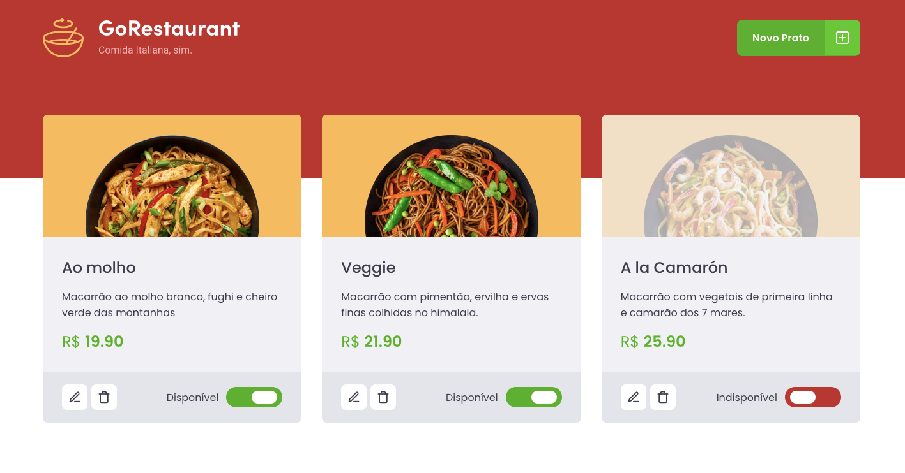
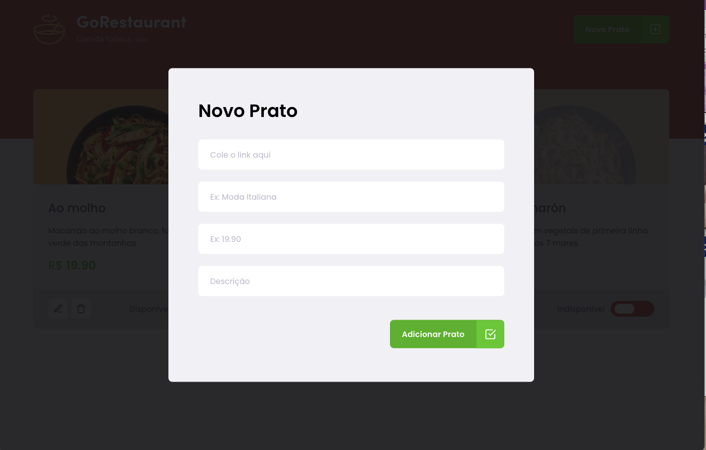
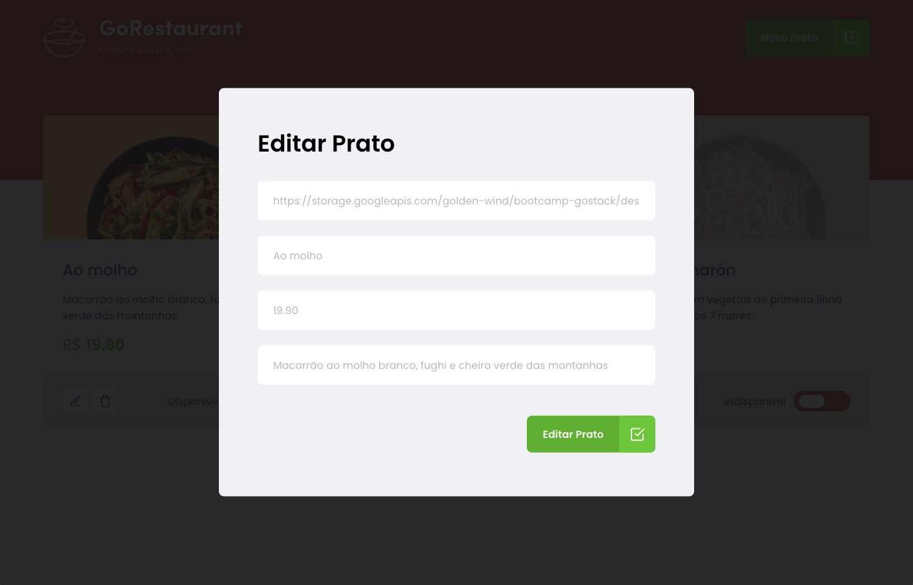

## 🧪 Tecnologias

Esse projeto foi desenvolvido com as seguintes tecnologias:

- [React](https://reactjs.org)

## 🧪 Telas

Home:

<h1 align="center">
    
</h1>
Modal Adicionando Produto:
<br>
<br>
<h1 align="center">
    
</h1>
Modal Editando Produto:
<br>
<br>
<h1 align="center">
    
</h1>

## 🚀 Como executar

Clone o projeto e acesse a pasta do mesmo.

```bash
$ git clone https://github.com/mariliamessias/ignite-go-restaurant
$ cd ignite-movies
```

Para iniciá-lo, siga os passos abaixo:
```bash
# Instalar as dependências
$ yarn

# Iniciar o projeto
$ yarn start
```
O app estará disponível no seu browser pelo endereço http://localhost:3000.

## 💻 Projeto

Projeto do curso Ignite da Rocketseat que tem como objetivo fixar os conhecimentos sobre refatoração de um projeto em Javascript para Typescript.

## 📝 License

Esse projeto está sob a licença MIT. Veja o arquivo [LICENSE](LICENSE.md) para mais detalhes.
